# VM Fleet Commander — Azure Compute Infrastructure Project

## Overview

Built a production-style Azure compute environment focused on:

* Azure Virtual Machine Scale Sets (VMSS)
* Windows and Linux virtual machines
* Azure Load Balancer
* Autoscaling infrastructure
* Infrastructure automation using PowerShell
* Azure Backup and recovery
* Linux administration with NGINX
* Enterprise-style networking

This project was designed to simulate a real cloud infrastructure deployment and strengthen hands-on skills for:

* Azure Administration (AZ-104)
* Junior System Administration
* Infrastructure Engineering
* Cloud Operations


# Architecture

## Resource Group Overview

This resource group contains:

* Windows Virtual Machines
* Linux Virtual Machine
* Azure VM Scale Set
* Azure Load Balancer
* Virtual Network
* Network Security Groups
* Recovery Services Vault
* Backup resources
* Storage Account for automation scripts

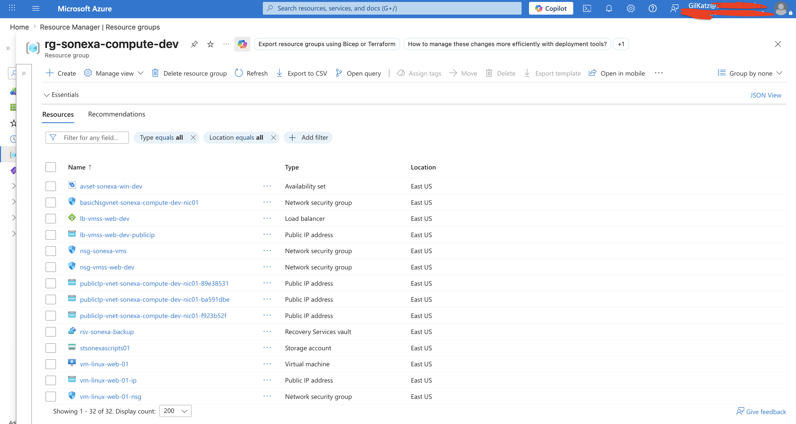
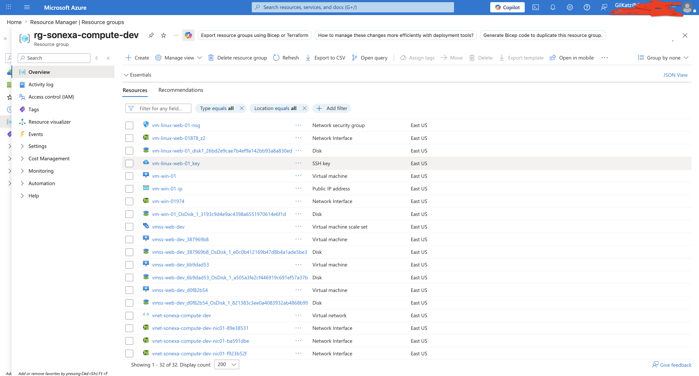

## Resource Organization

Resources were organized using consistent naming conventions, centralized resource groups, tagging, and segmented networking to simulate a production-style Azure infrastructure environment.

## Infrastructure Architecture Diagram

```text
                         ┌──────────────────────────┐
                         │        Internet          │
                         └────────────┬─────────────┘
                                      │
                                      ▼
                    ┌────────────────────────────────┐
                    │   Azure Public Load Balancer   │
                    │        HTTP Traffic : 80       │
                    └────────────────┬───────────────┘
                                     │
                                     ▼
┌──────────────────────────────────────────────────────────────────────┐
│                        Azure Virtual Network                         │
│                                                                      │
│  ┌───────────────────────────────────────────────────────────────┐   │
│  │ Subnet 1 - VMSS Web Tier                                      │   │
│  │                                                               │   │
│  │  Windows VM Scale Set                                         │   │
│  │  Initial Capacity: 1 VM                                       │   │
│  │  Scaled Out To: 3 VM Instances                                │   │
│  │  Autoscale: CPU-Based Scaling                                 │   │
│  │                                                               │   │
│  │  ┌────────────┐  ┌────────────┐  ┌────────────┐               │   │
│  │  │ IIS VM 01  │  │ IIS VM 02  │  │ IIS VM 03  │               │   │
│  │  └────────────┘  └────────────┘  └────────────┘               │   │
│  │                                                               │   │
│  │  NSG: HTTP / Management Access                                │   │
│  └───────────────────────────────────────────────────────────────┘   │
│                                                                      │
│  ┌───────────────────────────────────────────────────────────────┐   │
│  │ Subnet 2 - Standalone VM Tier                                 │   │
│  │                                                               │   │
│  │  ┌──────────────────────────────┐   ┌──────────────────────┐  │   │
│  │  │ Windows Availability Set     │   │ Ubuntu Linux VM      │  │   │
│  │  │                              │   │                      │  │   │
│  │  │ Windows VM 01                │   │ NGINX Web Server     │  │   │
│  │  │ Windows VM 02                │   │ SSH Administration   │  │   │
│  │  │                              │   │                      │  │   │
│  │  │ Fault Domains                │   │ Linux Admin Tasks    │  │   │
│  │  │ Update Domains               │   │                      │  │   │
│  │  └──────────────────────────────┘   └──────────────────────┘  │   │
│  │                                                               │   │
│  │  NSG: RDP / SSH / HTTP Access                                 │   │
│  └───────────────────────────────────────────────────────────────┘   │
│                                                                      │
└──────────────────────────────────────────────────────────────────────┘


                    ┌────────────────────────────────┐
                    │ Azure Storage Account          │
                    │ Blob Container                 │
                    │ PowerShell Deployment Scripts  │
                    └────────────────┬───────────────┘
                                     │
                                     ▼
                    ┌────────────────────────────────┐
                    │ Custom Script Extension        │
                    │ Downloads + Executes Script    │
                    └────────────────┬───────────────┘
                                     │
                                     ▼
                    ┌────────────────────────────────┐
                    │ VMSS IIS Automation            │
                    │ Installs IIS + Deploys Website │
                    └────────────────────────────────┘


                    ┌────────────────────────────────┐
                    │ Recovery Services Vault        │
                    │ Azure Backup Protection        │
                    │ Windows + Linux VM Backups     │
                    └────────────────────────────────┘
```

# Windows VM Scale Set (VMSS)

## VMSS Deployment

Created an Azure Virtual Machine Scale Set running multiple Windows Server instances behind a public Azure Load Balancer.

The environment automatically distributes traffic across multiple virtual machines.

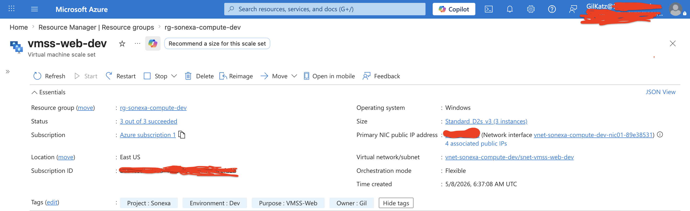

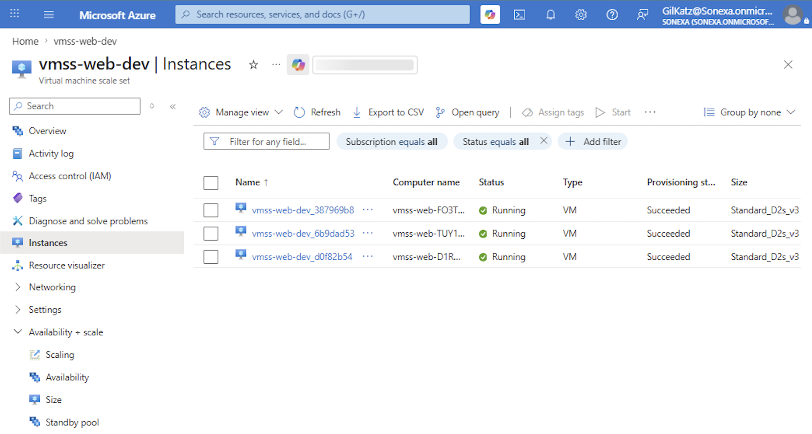


# Azure Load Balancing

Configured a public Azure Load Balancer connected to the VM Scale Set.

The load balancer distributes incoming HTTP traffic across all VMSS instances.

## Load Balancer Configuration

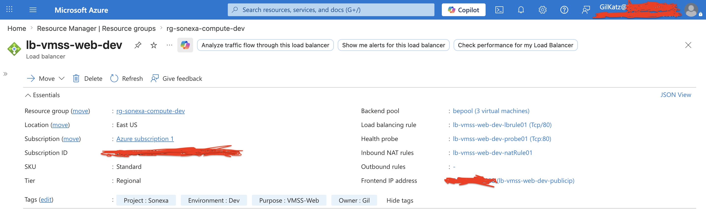


# Autoscaling Configuration

Configured Azure Autoscale rules for the VM Scale Set.

### Autoscale Logic

* Scale out when CPU usage increases
* Automatically provision additional VM instances
* Improve application availability and performance
* Reduce manual infrastructure management

## Autoscale Rules

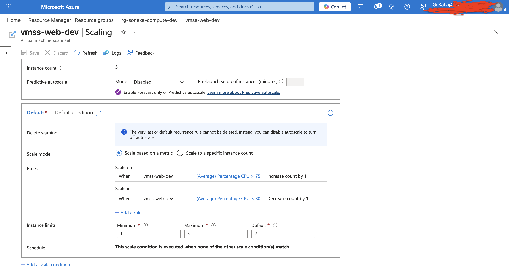


## Availability Configuration

In addition to the VM Scale Set environment, an Azure Availability Set was configured for standalone Windows virtual machines.

This improves workload resilience by distributing virtual machines across separate fault domains and update domains to reduce downtime during planned maintenance or hardware failures.

## Windows RDP Administration

Remote administration of Windows virtual machines was performed using Remote Desktop Protocol (RDP) for IIS validation, system configuration, and infrastructure management tasks.


# Infrastructure Automation

Used Azure Custom Script Extension to automatically:

* Install IIS
* Configure the web server
* Deploy a custom HTML/CSS landing page
* Restart IIS services automatically

This demonstrates infrastructure automation and provisioning using PowerShell.

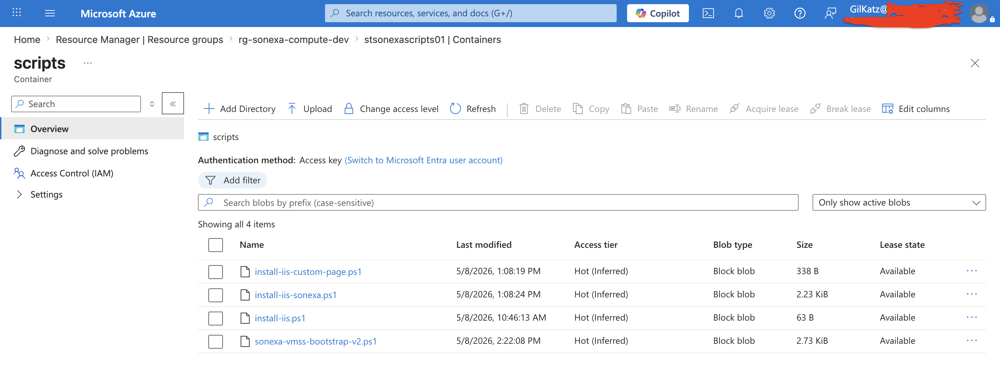

PowerShell deployment scripts were stored inside an Azure Storage Account Blob Container and accessed securely by the VM Scale Set Custom Script Extension during automated provisioning.

This simulates a common enterprise deployment pattern where infrastructure automation assets are centrally stored and distributed to virtual machine environments dynamically.

## Custom Script Extension Deployment

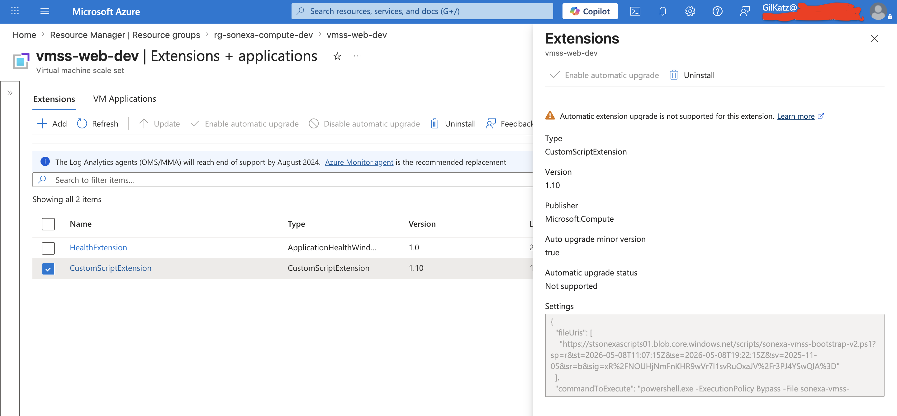

# PowerShell Deployment Automation

Created a PowerShell bootstrap script used by the VM Scale Set.

The script:

* Installs IIS automatically
* Creates the web root directory
* Generates a custom HTML dashboard
* Displays the VM hostname dynamically
* Restarts IIS automatically


## VMSS Bootstrap Automation Script

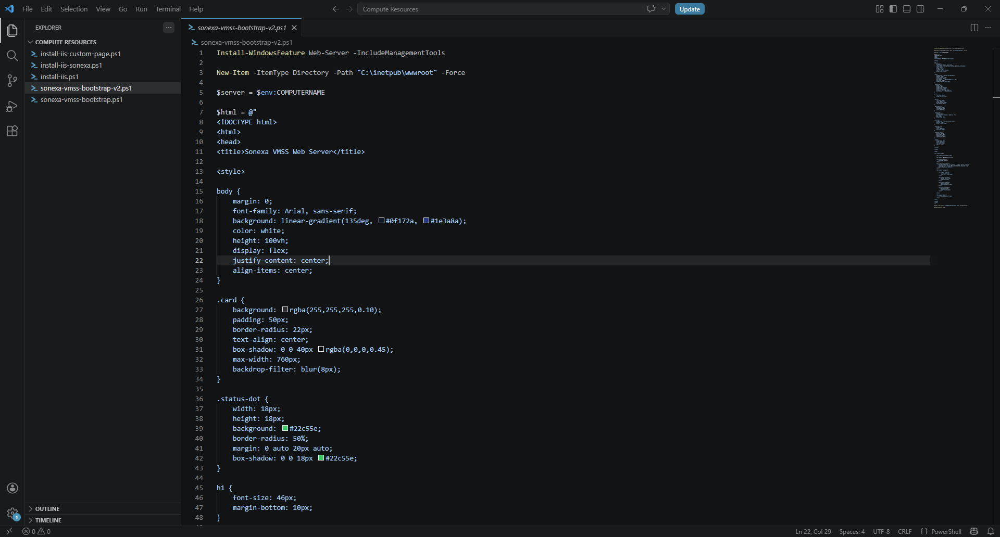


# Final VMSS Web Application

Successfully deployed a custom IIS web application running behind the Azure Load Balancer.

The webpage dynamically displays the VM instance currently serving traffic.

This validates:

* VMSS deployment
* Load balancing
* IIS automation
* Web server functionality
* Azure networking


## Final IIS VMSS Web Page

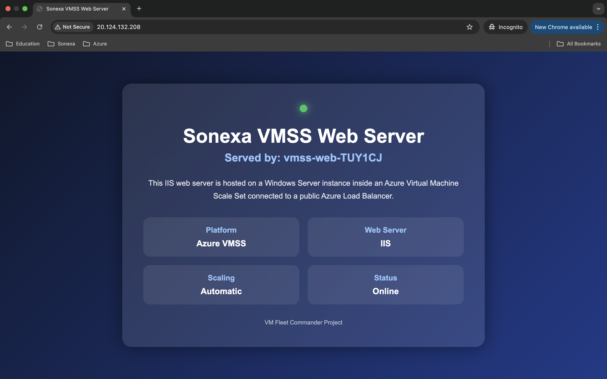


# Linux Virtual Machine

Created a separate Ubuntu Linux Virtual Machine running NGINX.

The Linux VM demonstrates:

* Linux administration
* SSH management
* Linux networking
* Web server management using systemd

## Linux NGINX Web Application

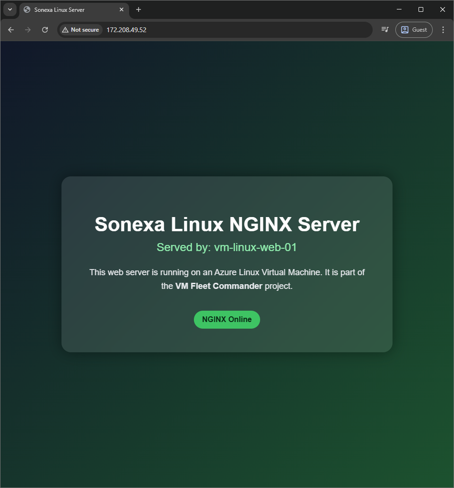

# Linux SSH Administration

Connected securely to the Linux VM using SSH and performed infrastructure administration tasks.

Demonstrated:

* Network interface inspection
* Service monitoring
* NGINX process validation
* Linux command-line administration

## Linux SSH Session

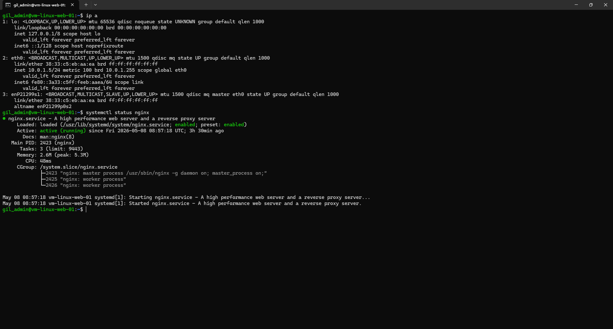


# Azure Backup and Recovery

Configured Azure Backup using a Recovery Services Vault.

Backup protection was enabled for:

* Windows virtual machines
* Linux virtual machines

This project demonstrates:

* Backup configuration
* Recovery point management
* Disaster recovery concepts
* Business continuity planning

## Recovery Services Vault

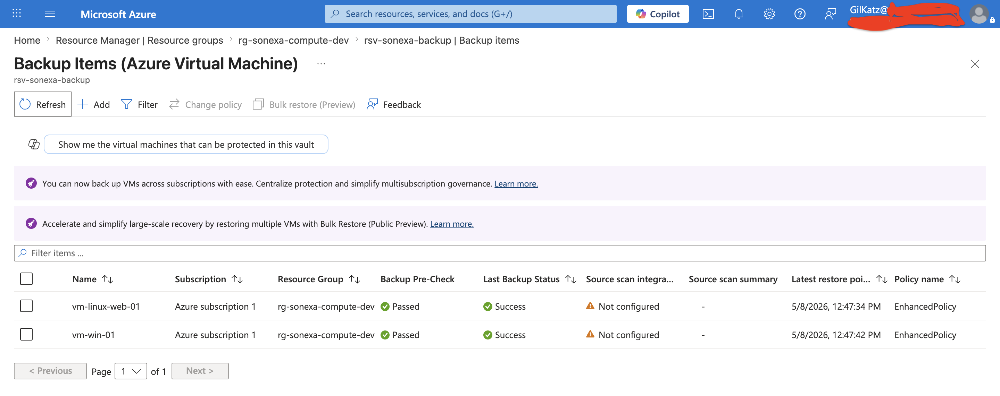

## Successful Backup Jobs

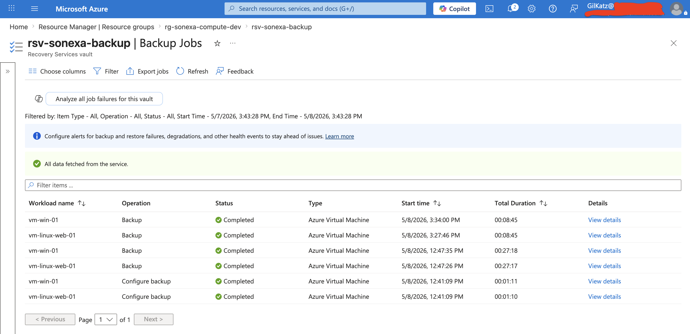


# Azure Networking

Configured Azure networking components for the environment.

Components include:

* Virtual Network
* Subnets
* Public IP addresses
* Network Security Groups
* Load Balancer connectivity

The environment uses multiple subnets and Network Security Groups (NSGs) to segment workloads and control inbound management traffic such as HTTP, HTTPS, SSH, and RDP access.

## Virtual Network Configuration

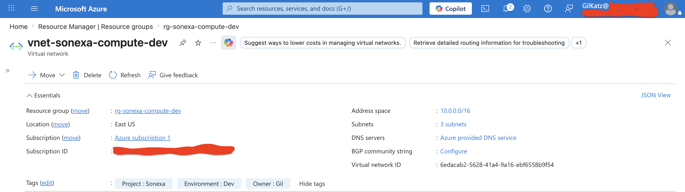


# Skills Demonstrated

## Azure

* Azure Virtual Machines
* Azure VM Scale Sets
* Azure Load Balancer
* Azure Backup
* Azure Networking
* Azure Autoscaling
* Azure Custom Script Extension

## Infrastructure & Operations

* Fault domains
* Update domains
* VM scaling operations
* Backup monitoring
* Remote infrastructure administration

## Networking & Security

* Virtual Networks (VNets)
* Subnet segmentation
* Network Security Groups (NSGs)
* Public IP management
* Azure Load Balancer configuration

## Windows Administration

* IIS deployment
* PowerShell automation
* VM provisioning
* Infrastructure scripting

## Linux Administration

* Ubuntu Server
* NGINX
* SSH management
* Linux networking
* systemctl service management

## Infrastructure Concepts

* High availability
* Horizontal scaling
* Backup and recovery
* Infrastructure automation
* Cloud operations

# Technologies Used

* Microsoft Azure
* Windows Server
* Ubuntu Linux
* IIS
* NGINX
* PowerShell
* Azure CLI
* Azure Portal


# Project Summary

This project simulates a real-world cloud infrastructure environment using Azure compute services.

The deployment includes:

* Windows VM Scale Sets
* Linux web servers
* Infrastructure automation
* Load balancing
* Autoscaling
* Backup and disaster recovery
* Hybrid Windows/Linux administration

The goal of this project was to build practical infrastructure engineering experience beyond theoretical Azure learning.
